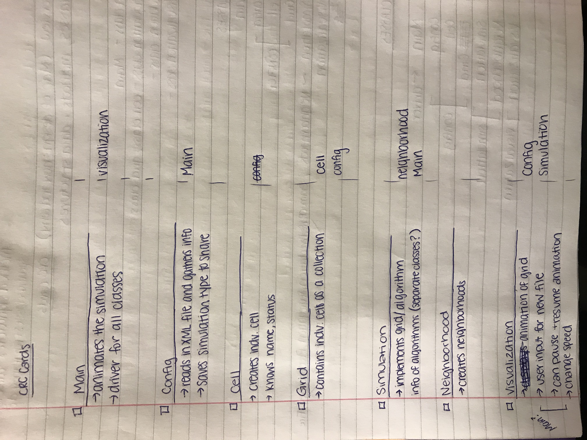

# Simulation Design Plan
### 29
### Claudia Chapman, Libba Lawrence, Andrew Krier, Alexander Uzochukwu

## Introduction
The goal of this project is to create a flexible architecture that implements different versions of a cellular automata.
The design will have a main driver class that is responsible for communicating with the three other aspects of this project 
being configuration, simulation, and visualization. The configuration part of this project will be reading the XML file 
that sets up the specifications of a given cellular automata system and the initial conditions of the cells. The simulation 
part of the project is responsible for updating the values of the individual cells based on the current value as well as 
the values of the cells in the neighborhood with regards to the rules set up by the configuration. Then, the program will 
continue as a closed loop between simulation and visualization which will display the updated values of the cells until a new
configuration is called. 

## Overview

## User Interface

## Design Details

## Design Considerations

#### Components

#### Use Cases

## Team Responsibilities

 * Team Member #1

 * Team Member #2

 * Team Member #3

